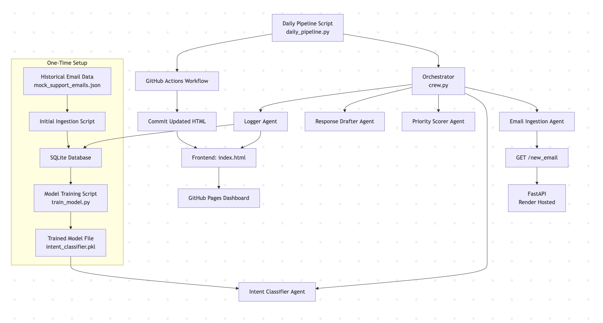
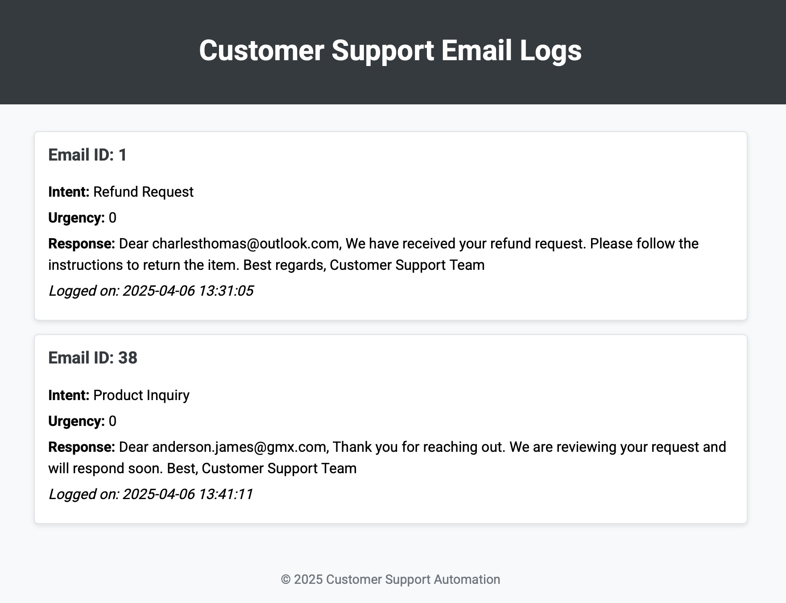

# Technical Report: Customer Support Automation


## 1. Introduction and Aim

The aim of this project is to automate the customer support process for a solopreneur by building a modular MLOps pipeline that classifies and responds to incoming customer emails in a consistent, efficient manner. The system is designed to:

- **Ingest and store historical email data** using a lightweight SQLite database.
- **Train an intent classifier** using traditional NLP methods (TF-IDF and Logistic Regression).
- **Implement a modular agent-based architecture** (simulated with our custom orchestrator) to process new emails, including intent classification, urgency scoring, and response drafting.
- **Deploy a FastAPI endpoint** to serve live email data.
- **Automate the entire pipeline** using GitHub Actions with a continuously updated frontend via GitHub Pages.

This project not only demonstrates the practical application of NLP in an automated support system but also serves as a solid foundation for further extensions such as integrating advanced LLMs or multi-agent orchestration frameworks like CrewAI.

## Pipeline Overview

This diagram reflects the actual file structure, control flow, and interactions between modules, agents, the API, and the database.



## Repository Structure 

``` 
customer-support-crew/
├── .github/
│   └── workflows/
│       └── respond.yml               # GitHub Actions workflow for daily pipeline execution
├── agents/
│   ├── email_ingestion.py           # Fetches new emails from the API
│   ├── intent_classifier.py         # Predicts intent using trained model
│   ├── priority_scorer.py           # Assigns urgency scores to emails
│   ├── response_drafter.py          # Drafts responses based on predicted intent
│   └── logger.py                    # Logs processed emails and updates frontend
├── api/
│   └── main.py                      # FastAPI app serving the /new_email endpoint
├── data/
│   └── mock_support_emails.json     # Dataset of annotated support emails
├── database/
│   └── schema.sql                   # SQLite schema definition
├── docs/
│   └── index.html                   # Static frontend for log monitoring (GitHub Pages)
├── models/
│   └── intent_classifier.pkl        # Serialized trained model
├── .gitignore                       # Ignore venv, model, DB, etc.
├── README.md                        # Project overview and documentation
├── crew.py                          # Orchestrator: runs all agents in sequence
├── daily_pipeline.py                # Entry point for daily CI/CD pipeline
├── initial_ingestion.py             # Loads historical data into the SQLite database
├── requirements.txt                 # Project dependencies
├── train_model.py                   # Trains the intent classification model
```

## Getting Started

To run the full pipeline locally:

```bash
# Set up environment
python -m venv venv
source venv/bin/activate
pip install -r requirements.txt

# One-time DB setup
python initial_ingestion.py

# Train the model
python train_model.py

# Run the pipeline manually
python daily_pipeline.py
```
---

## 2. Technical Details of Each Pipeline Component

### Step 1: One-Time Setup – Data Ingestion and Model Training

#### 2.1 Historical Data and Storage

- **Historical Data Generation:**  
  A dataset of 100 realistic support emails is generated in JSON format. Each entry contains structured metadata and content, including `email_id`, `timestamp`, `sender`, `subject`, `body`, `intent_label`, `urgency_score`, and `response`. While all fields are present, only a subset is used during training and inference (see below).

- **Database Schema (`database/schema.sql`):**  
  The SQLite schema creates a `support_emails` table mirroring the JSON structure. SQLite was chosen for local development and easy integration into a CI/CD pipeline.

- **Ingestion Script (`initial_ingestion.py`):**  
  This one-time script loads the full JSON dataset into the database for model training. It is not part of the daily pipeline.

- **Note:** The same `support_emails.db` file is used for both model training (via historical ingestion) and logging newly processed API emails. This ensures continuity and a full trace of all system activity in one unified location.

#### 2.2 Model Training

- **Preprocessing and Training (`train_model.py`):**  
  The classifier is trained exclusively on the `subject` and `body` fields of each email — concatenated and lowercased before TF-IDF vectorization. Critically, even though the dataset includes `intent_label`, `urgency_score`, and `response`, only `intent_label` is used as the target label. There is **no leakage** from urgency or response.

- **Model Pipeline:**  
  A Scikit-learn pipeline is built using TF-IDF and Logistic Regression — chosen for its speed, interpretability, and robustness for small datasets.

- **Model Evaluation:**  
  A test/train split is used to validate model performance. `classification_report` output includes precision, recall, and F1 for each intent.

- **Model Persistence:**  
  The final model is saved as `models/intent_classifier.pkl` and used during daily inference.

---

### Step 2: Daily Pipeline Execution

#### 2.3 Modular Agent-Based Pipeline

This stage is executed daily by `daily_pipeline.py`, which sequentially calls each agent via the orchestrator (`crew.py`).

**Execution order and logic:**

1. **Email Ingestion Agent (`agents/email_ingestion.py`):**  
   - Calls the FastAPI endpoint hosted on Render (`/new_email`).
   - Returns a randomized email with full metadata.
   - Inserts the raw `subject` and `body` into the database **if not already present** using `email_id` as key.
   - *Only the subject and body are used downstream*.

2. **Intent Classifier Agent (`agents/intent_classifier.py`):**  
   - Loads the trained model (`intent_classifier.pkl`).
   - Predicts the email’s intent using the subject + body.
   - Ignores pre-annotated intent from the API to avoid leakage.

3. **Priority Scorer Agent (`agents/priority_scorer.py`):**  
   - Assigns an urgency score (0–2) using sentiment analysis via TextBlob and keyword heuristics.
   - The urgency score is calculated independently from the one in the JSON.

4. **Response Drafter Agent (`agents/response_drafter.py`):**  
   - Generates a first-draft reply using rule-based templates linked to the predicted intent.
   - Templates are polite, customizable, and domain-specific.

5. **Logger Agent (`agents/logger.py`):**  
   - Updates the `support_emails.db` table using `INSERT OR REPLACE`.
   - Writes a log entry to `docs/index.html` using string insertion just before `<!-- End of logs -->` inside `<div id="logs">`.
   - Ensures **daily traceability** via database and dashboard.

#### 2.4 Orchestration

- **`crew.py`:**  
  - Acts as a lightweight orchestrator, simulating CrewAI-like modularity.
  - Executes each agent sequentially.
  - Designed to be easily replaceable with a proper task routing engine in the future.

---

### Step 3: API Service and CI/CD Automation

#### 2.5 API Endpoint

- **FastAPI App (`api/main.py`):**  
  - Serves `/new_email` with randomized samples from the same dataset used for training (`mock_support_emails.json`). The full record is served, but only `subject` and `body` are used in daily processing to ensure no leakage.
  - Hosted at:  
    [https://customer-support-crew.onrender.com/new_email](https://customer-support-crew.onrender.com/new_email)

- **Returned Object:**  
  While the full email object contains pre-annotated fields, only `subject` and `body` are used in actual processing — ensuring reproducibility and avoiding training bias.

#### 2.6 GitHub Actions

- **CI/CD Workflow (`.github/workflows/respond.yml`):**  
  - Runs once daily via `cron` at 07:30 UTC.
  - Installs dependencies from `requirements.txt`.
  - Executes `daily_pipeline.py`.
  - Commits the updated `docs/index.html` if it has changed.
  - Pushes changes using `GITHUB_TOKEN`.

---

## Frontend



### Step 4: Frontend Monitoring

#### 2.7 Static Dashboard

- **Frontend HTML (`docs/index.html`):**  
  - A simple, styled log showing all processed emails.
  - Includes email ID, predicted intent, urgency score, generated response, and timestamp.
  - Updated automatically by the Logger Agent.

- **Insertion Logic:**  
  - Log entries are inserted just before the comment `<!-- End of logs -->`.
  - This ensures new entries appear **above** older ones in the list.

- **Public URL:**  
  View the live dashboard at:  
  [https://niklas2165.github.io/customer-support-crew/](https://niklas2165.github.io/customer-support-crew/)

---

## 3. Evaluation and Monitoring Strategy

### 3.1 Model Evaluation

- **Valid Split & Metrics:**  
  Model evaluated using stratified train/test split. Outputs include classification report with macro/micro-average scores.

- **Leakage Prevention:**  
  Only raw text (`subject + body`) is used as input, and only `intent_label` is the output target. No urgency or response fields influence the model.

### 3.2 Runtime Monitoring

- **Agent Logging:**  
  Each agent logs key actions using Python’s built-in logging module.

- **HTML Frontend:**  
  Displays real-time log of most recent pipeline run — great for visibility and debugging.

- **SQLite Recordkeeping:**  
  Database contains full logs of all emails and their latest classification, urgency, and response — acting as a traceable archive.

### 3.3 CI/CD Monitoring

- **GitHub Actions Logs:**  
  Each run logs the full workflow, with step-by-step detail for troubleshooting.

- **Auto Deployment:**  
  If changes are made to the frontend log, they're committed and served via GitHub Pages.

---

## 4. Conclusion

This MLOps pipeline automates customer support by combining:

- Lightweight training and inference  
- Modular orchestration with isolated agents  
- External data ingestion from a hosted API  
- CI/CD and GitHub-based automation  
- Daily updates and monitoring via a public dashboard

It is interpretable, robust, and ready for future upgrades — including CrewAI, RAG pipelines, or inbox scraping.

---

## 5. Live Demo and Access

- **API Endpoint (Render):**  
  [https://customer-support-crew.onrender.com/new_email](https://customer-support-crew.onrender.com/new_email)

- **Frontend Dashboard (GitHub Pages):**  
  [https://niklas2165.github.io/customer-support-crew/](https://niklas2165.github.io/customer-support-crew/)
