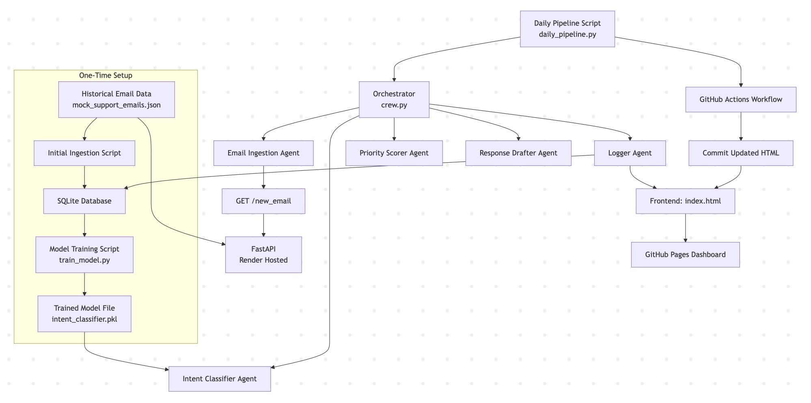

# Technical Report: Solopreneur Customer Support Automation

## 1. Introduction and Aim

The aim of this project is to automate the customer support process for a solopreneur by building a modular MLOps pipeline that classifies and responds to incoming customer emails in a consistent, efficient manner. The system is designed to:

- **Ingest and store historical email data** using a lightweight SQLite database.
- **Train an intent classifier** using traditional NLP methods (TF-IDF and Logistic Regression).
- **Implement a modular agent-based architecture** (simulated with our custom orchestrator) to process new emails, including intent classification, urgency scoring, and response drafting.
- **Deploy a FastAPI endpoint** to serve live email data.
- **Automate the entire pipeline** using GitHub Actions with a continuously updated frontend via GitHub Pages.

This project not only demonstrates the practical application of NLP in an automated support system but also serves as a solid foundation for further extensions such as integrating advanced LLMs or multi-agent orchestration frameworks like CrewAI.

## Pipeline Overview

---

## 2. Technical Details of Each Pipeline Component

### 2.1 Data Ingestion and Storage

- **Historical Data Generation:**  
  A dataset of 100 realistic support emails is generated in JSON format. Each entry contains structured metadata and content, including `email_id`, `timestamp`, `sender`, `subject`, `body`, `intent_label`, `urgency_score`, and `response`. While all fields are present, only a subset is used during training and inference (see 2.2 and 2.3).

- **Database Schema (`database/schema.sql`):**  
  The SQLite schema creates a `support_emails` table mirroring the JSON structure. SQLite was chosen for local development and easy integration into a CI/CD pipeline.

- **Ingestion Script (`initial_ingestion.py`):**  
  This one-time script loads the full JSON dataset into the database for model training. During daily operations, ingestion is handled by a separate agent described below.

### 2.2 Model Training

- **Preprocessing and Training (`train_model.py`):**  
  The classifier is trained exclusively on the `subject` and `body` fields of each email — which are concatenated and lowercased before TF-IDF vectorization. Critically, even though the historical dataset includes `intent_label`, `urgency_score`, and `response`, only `intent_label` is used as the target label, and no leakage occurs from `urgency_score` or `response` during training.

- **Pipeline Construction:**  
  A Scikit-learn pipeline is constructed using TF-IDF and Logistic Regression — selected for interpretability, efficiency, and suitability for small, multi-class datasets.

- **Model Evaluation:**  
  A test/train split is used to assess the model, with per-class precision, recall, and F1-scores displayed to evaluate balance across intent types.

- **Model Persistence:**  
  The trained model is saved as `intent_classifier.pkl` for downstream use during inference.

### 2.3 Modular Agent Architecture

- **Agent-Based Design:**  
  Each stage of the daily pipeline is encapsulated in its own Python module within `agents/`. This modular design ensures flexibility and encourages reuse and expansion.

- **Agents:**
  - **Email Ingestion Agent (`agents/email_ingestion.py`):**  
    Queries the live API hosted on Render (`/new_email`) to fetch one randomized email per day. Even though the returned object includes fields like `intent_label`, `urgency_score`, and `response`, only the raw `subject` and `body` are used downstream — ensuring the system recomputes these values independently. If the email is not yet in the database, it is inserted using a unique `email_id`.
  
  - **Intent Classifier Agent (`agents/intent_classifier.py`):**  
    Loads the previously trained model and classifies the intent based solely on `subject` + `body`. This ensures that the model is never influenced by metadata like sender, timestamp, or pre-annotated labels.

  - **Priority Scorer Agent (`agents/priority_scorer.py`):**  
    Scores urgency using a mix of keyword heuristics and sentiment analysis via TextBlob. The score ranges from 0–2 and reflects the emotional intensity or criticality of the message — independent of any precomputed values.

  - **Response Drafter Agent (`agents/response_drafter.py`):**  
    Generates a structured, rule-based response using templates keyed to the predicted intent. These templates use natural tone and prefilled instructions, simulating a first-pass support response.

  - **Logger Agent (`agents/logger.py`):**  
    Commits the fully processed email — including predicted intent, scored urgency, and drafted response — to the SQLite database using `INSERT OR REPLACE`. It also appends a formatted HTML block into `docs/index.html` before the comment marker `<!-- End of logs -->`.

- **Orchestration (`crew.py`):**  
  This script orchestrates the agents linearly to simulate CrewAI-style modularity. Though simple and synchronous, it enables end-to-end processing and provides a clear structure for future expansion into true multi-agent workflows.

### 2.4 API Implementation

- **FastAPI Endpoint (`api/main.py`):**  
  The `/new_email` endpoint randomly selects an email from the original 100-row dataset. Each request returns a realistic customer email object including metadata. While the returned object contains annotations, the pipeline recomputes intent and urgency scores from scratch using only the `subject` and `body`.

- **Deployment on Render:**  
  The API is publicly accessible at:  
  **[https://customer-support-crew.onrender.com/new_email](https://customer-support-crew.onrender.com/new_email)**  
  This endpoint acts as the data source for daily pipeline runs.

### 2.5 Daily Pipeline and Automation

- **Daily Pipeline (`daily_pipeline.py`):**  
  Runs the orchestrator (`crew.run_pipeline()`), which fetches one new email from the API, stores it if not already in the database, classifies it, scores urgency, generates a response, logs the result, and updates the static frontend.

- **CI/CD Integration with GitHub Actions (`.github/workflows/respond.yml`):**
  - **Scheduled Runs:** Cron trigger set to run daily at 07:30 UTC.
  - **Dependency Installation:** Uses `pip install -r requirements.txt`.
  - **Frontend Commit:** Commits only if `docs/index.html` changes.
  - **Permissions:** GitHub Actions is granted write access to push changes using `GITHUB_TOKEN`.

### 2.6 Frontend for Monitoring

- **Static Frontend (`docs/index.html`):**  
  A clean, card-based layout renders each processed email in reverse chronological order. The frontend is served through GitHub Pages and updated automatically once per day.

- **Update Logic:**  
  The `Logger Agent` uses simple HTML string replacement to inject new logs just before the marker `<!-- End of logs -->` within `
`. This ensures the dashboard grows incrementally with each pipeline run.

- **Live Frontend URL:**  
  View the public dashboard at:  
  **[https://niklas2165.github.io/customer-support-crew/](https://niklas2165.github.io/customer-support-crew/)**

### 2.7 Database Utilities

- **db_utils.py:**  
  A placeholder module that can eventually encapsulate common database operations like querying logs, updating schema versions, or exporting CSV backups.

---

## 3. Evaluation and Monitoring Strategy

### 3.1 Model Evaluation

- **Performance Report:**  
  The model is evaluated using a stratified train/test split and `classification_report`. Scores are reviewed per intent label to identify underrepresented or poorly predicted classes.

- **Training Validity:**  
  Only raw text (subject + body) is used as input, and only `intent_label` as the output, ensuring a clean supervised learning setup with no leakage from response or urgency fields.

### 3.2 Runtime Monitoring

- **Agent Logs:**  
  All agents log key actions using Python’s `logging` module. These logs are visible locally or via GitHub Actions during each run.

- **Visual Feedback (Frontend):**  
  The HTML dashboard (`docs/index.html`) shows what email was processed, its intent, urgency, and generated response — with a timestamp for auditing.

- **Database Audit Trail:**  
  Every email — regardless of whether it came from the API or historical set — is logged in `support_emails.db`, providing a searchable archive.

### 3.3 CI/CD Monitoring

- **Run Visibility:**  
  Each GitHub Actions run exposes full logs under "Actions", allowing inspection of any agent step.

- **Auto-Deployment:**  
  If `docs/index.html` is updated, the change is automatically committed and served through GitHub Pages.

---

## 4. Conclusion

This MLOps pipeline automates solopreneur support by combining modular agents, ML-based intent classification, rule-based reasoning, and CI/CD deployment into a daily feedback loop. It adheres to good design practices by avoiding label leakage, tracking state via DB, and maintaining a clear separation between training and inference logic.

As designed, the system is lightweight, interpretable, and production-aware — but ready to evolve toward more intelligent architectures (e.g., LLM-based RAG, CrewAI orchestration, IMAP inbox integration).

---

## 5. Live Demo and Access

- **API Endpoint (Render):**  
  [https://customer-support-crew.onrender.com/new_email](https://customer-support-crew.onrender.com/new_email)

- **Frontend Dashboard (GitHub Pages):**  
  [https://niklas2165.github.io/customer-support-crew/](https://niklas2165.github.io/customer-support-crew/)
